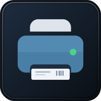
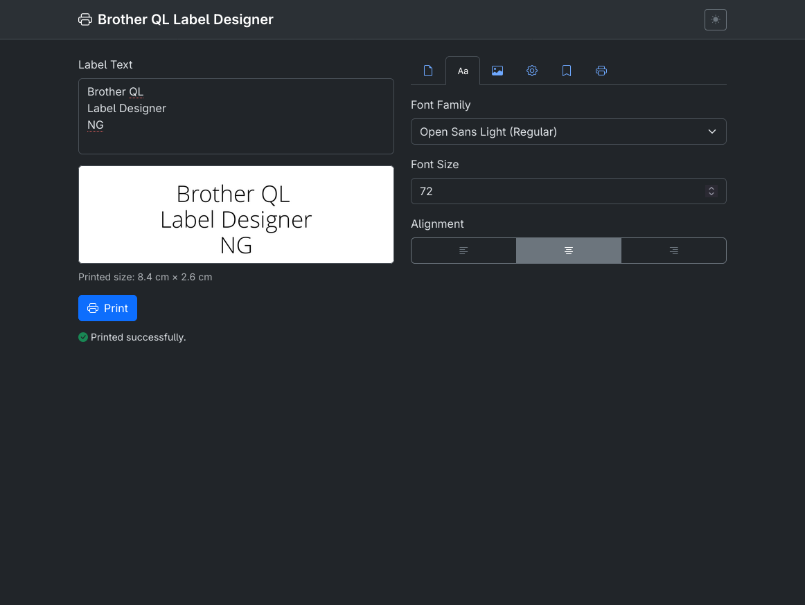
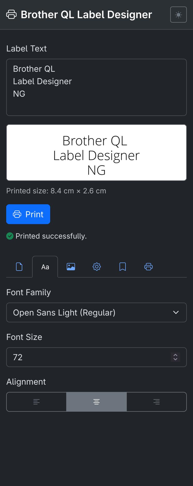

<div align="center">
  
  <h1>brother_ql_web_ng</h1>
  <p>A modernised web interface for Brother QL label printers.</p>

  [](https://www.python.org/)
  [](LICENSE)
  [](https://getbootstrap.com/)
  [](https://claude.ai)
</div>

---

> **Fork of [pklaus/brother_ql_web](https://github.com/pklaus/brother_ql_web)** — the original lightweight Bottle/Python label printing web service.
> This fork was **largely vibe-coded with [Claude Sonnet](https://claude.ai)** (Anthropic) in a single session. The underlying printing logic is unchanged; everything you see in the UI is new.

## What's new

- **Bootstrap 5.3.3** — replaced the old Bootstrap 3 / Glyphicons stack with CDN-served Bootstrap 5 + Bootstrap Icons
- **Dark / light mode** toggle, persisted across page loads
- **Responsive sidebar layout** — label designer on the left, saved configs + printer status on the right; collapses gracefully on mobile
- **Image upload** — embed a PNG/JPG alongside (or instead of) text on a label
- **Border option** — add a configurable-width border around the label
- **Printer status panel** — live USB device info, ink/media status, error state
- **Named config system** — save, load, rename, duplicate, reorder, and delete any number of named print configs, persisted to `saved_configs.json`
  - Drag-to-reorder with server-side persistence
  - Per-config **Save** button to overwrite with current settings
  - Relative timestamps ("just now", "3 min ago", "yesterday", …)
- **Overwrite / delete confirmations** on all destructive actions

## Screenshots

| Desktop | Mobile |
|---------|--------|
|  |  |

## Requirements

- Python 3.8+
- `fontconfig` on your system (`fc-list`) — pre-installed on most Linux distros; on macOS: `brew install fontconfig`
- A Brother QL printer accessible via USB (`pyusb`) or TCP

## Installation

```bash
git clone https://github.com/YOUR_USERNAME/brother_ql_web_ng.git
cd brother_ql_web_ng
python -m venv .venv
source .venv/bin/activate   # Windows: .venv\Scripts\activate
pip install -r requirements.txt
```

### USB permissions (Linux)

If the printer is USB and you don't want to run as root, add a udev rule:

```
SUBSYSTEM=="usb", ATTRS{idVendor}=="04f9", MODE="0666"
```

Save to `/etc/udev/rules.d/99-brother-ql.rules` and reload: `sudo udevadm control --reload-rules`.

## Configuration

```bash
cp config.example.json config.json
```

Edit `config.json` to set your printer model, connection string, default label size, and port.

```json
{
  "SERVER":  { "PORT": 8013 },
  "PRINTER": { "MODEL": "QL-700", "PRINTER": "usb://0x04f9:0x2042" },
  "LABEL":   { "DEFAULT_SIZE": "29x90", "DEFAULT_ORIENTATION": "standard" }
}
```

Supported printer connection strings:

| Backend | Example |
|---------|---------|
| USB (pyusb) | `usb://0x04f9:0x2042` |
| Network | `tcp://192.168.1.50:9100` |
| File / devnode | `file:///dev/usb/lp0` |

## Startup

```bash
.venv/bin/python brother_ql_web.py
```

Command-line arguments override `config.json`:

```
usage: brother_ql_web.py [-h] [--port PORT] [--loglevel LOGLEVEL]
                         [--font-folder FONT_FOLDER]
                         [--default-label-size DEFAULT_LABEL_SIZE]
                         [--default-orientation {standard,rotated}]
                         [--model {QL-500,...,QL-1060N}]
                         [printer]
```

Then open **http://localhost:8013** in your browser.

## API

A minimal text-print endpoint is available for scripted use:

```
GET /api/print/text?text=Hello&font_size=80&font_family=DejaVu+Serif&label_size=29x90
```

## Project structure

```
brother_ql_web.py      # Bottle app + REST API
font_helpers.py        # fc-list font discovery
config.example.json    # template config (copy → config.json)
saved_configs.json     # runtime config store (gitignored)
views/
  base.jinja2          # Bootstrap 5 base template
  labeldesigner.jinja2 # main UI
static/
  logo.svg             # repo logo
  css/custom.css
```

## License

GPLv3 — see [LICENSE](LICENSE).

Third-party components bundled or loaded from CDN:

| Component | License |
|-----------|---------|
| [Bootstrap 5](https://github.com/twbs/bootstrap) | MIT |
| [Bootstrap Icons](https://icons.getbootstrap.com/) | MIT |
| [jQuery](https://github.com/jquery/jquery) | MIT |
| [brother_ql](https://github.com/pklaus/brother_ql) | GPL |

---

<div align="center">
  <sub>Based on <a href="https://github.com/pklaus/brother_ql_web">pklaus/brother_ql_web</a> · UI rewrite vibe-coded with <a href="https://claude.ai">Claude Sonnet</a> (Anthropic)</sub>
</div>
